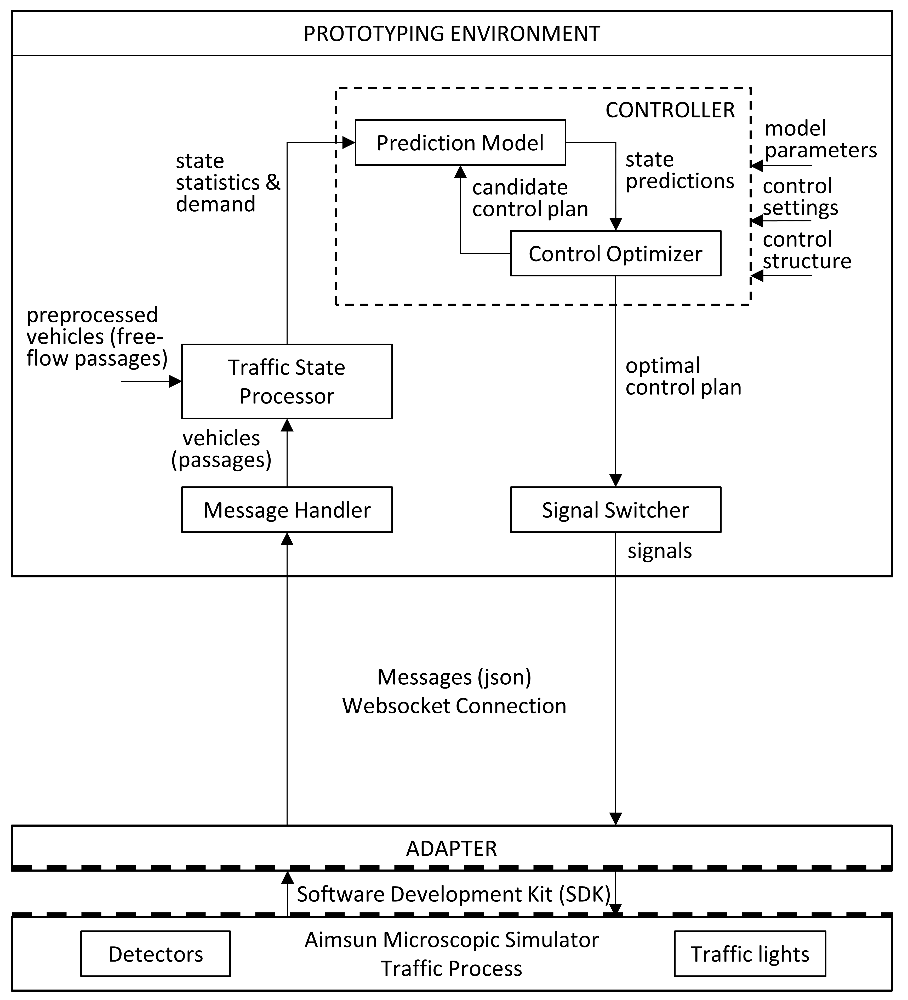

# Real-Time Predictive Traffic Signal Control Application for Prototyping

This prototyping environment is made available to evaluate predictive traffic signal control applications in a 'controlled' real-time simulation environment to gain insights for development and design of these predictive control systems in real-life.

Contact: Muriel Verkaik-Poelman (muriel.verkaik-poelman@rhdhv.com)

The prototyping environment is developed as part of a PhD project to study the added value of predictions in traffic signal control applications. [THESISREF](). In this research project the prototyping environment is used for:
- Sensitivity analysis to study the effect of prediction errors on the control performance of model-based predictive traffic signal control on a single intersection. Publication: Poelman, M.C., A. Hegyi, A. Verbraeck, and H. van Lint. Sensitivity Analysis to Define Guidelines for Predictive Control Design. *Transportation Research Record*, 2020. 2674(6): 385–398. https://doi.org/10.1177/0361198120919114

- Sensitivity analysis to study the effect of prediction errors (due to model aggregation and biases) on the control performance of network-wide model-based predictive traffic signal control on a corridor of multiple intersections with a high chance of spillback. Publication: Poelman, M.C., A. Hegyi, A. Verbraeck, and H. van Lint. Structure-free model-based predictive signal control: A sensitivity analysis on a corridor with spillback. *Transportation Research Part C: Emerging Technologies*, 2023. 153. https://doi.org/10.1016/j.trc.2023.104174

- Development of a robust control approach explicitly considering the prediction uncertainties in real-time predictive traffic signal control. 
Publication: Poelman, M.C., A. Hegyi, A. Verbraeck, and H. van Lint. Robust approach for structure-free model-based predictive signal control considering uncertainties in model parameters. Under review, 2023.

The research project is a cooperation between [DiTTlab](https://www.tudelft.nl/en/ceg/about-faculty/departments/transport-planning/research/labs/data-analytics-and-traffic-simulation-lab/dittlab) of Delft University of Technology and [Royal HaskoningDHV](https://www.royalhaskoningdhv.com). 
The project is part of the overall project MiRRORS - Multiscale integrated traffic observatory for large road networks, sponsored by the Dutch Foundation for Scientific Research NWO / Applied Sciences under grant number 16270.

## Functionality
The application consists of three parts (see Application Structure). A microscopic simulator is used to represent the traffic process in real-life. A predictive traffic signal control application is developed as a separate (prototyping) environment that runs in parallel constantly re-evaluating and optimizing control decisions. An adapter (plugged-in the simulator) is used to handle the communication between the simulation environment and the traffic signal control application, receiving and sending (json) messages by a WebSocket connection. 

The real-time predictive traffic signal control application receives information on the current traffic state (on the level of individual vehicle passages) from the simulator (through the adapter). The controller optimizes the control plan, i.e., control decision sequence for the upcoming time horizon, based on a prediction of future traffic states. A traffic model is used to predict the evolution of traffic states in the network. An optimizer is applied to determine the most efficient control plan (according to a user-defined objective). The optimal control plan is sent to the simulator (through the adapter). The prediction time horizon is shifted, and the process repeats itself (rolling horizon process).     

## Installation
The application is originally developed for the microscopic traffic simulation package Aimsun. Aimsun is commercial software, and a license is required (including SDK). See [Aimsun](https://www.aimsun.com/) for more information on getting, installing, and using this traffic simulation software. 

The adapter is developed by Path2Mobility as a plug-in for Aimsun using the SDK of Aimsun. The adapter DTAModelingPlugin.dll is made available for Aimsun 8.2.0 R49069 (in [Adapter/](Adapter/)). Note that the adapter needs to be re-developed if other Aimsun versions are used or if other traffic simulation packages are applied. Place the adapter DTAModelingPlugin.dll (and xml file) in the plugins folder of Aimsun and the plug-in is automatically recognized by Aimsun.  
   
The Predictive Traffic Signal Control Application is made available as an open-source C++ code (for Windows the Visual Studio project DTAModeling.vcxproj is in [PrototypingSource/](PrototypingSource/)). The code must be compiled with a c++ compiler (is tested with C++17) and must be linked to external libraries (in [PrototypingSource/lib/](PrototypingSource/lib/)) needed for the WebSocket connection and communication (json messages) with the adapter. The control application DTAmodelling.exe has to be launched separately from Aimsun (adapter plug-in) and may run on a different location or device. 

## Simulation
The application uses the Aimsun GUI and microscopic simulator. The traffic case, consisting of a network configuration and a traffic demand, needs to be defined in the Aimsun GUI (an example traffic case is in [Example/](Example/)). To set up a microscopic simulation, define a Dynamic Scenario in Aimsun (with external control plans) and activate the adapter DTA Modeling 8.2.0. (Aimsun API). Specify the properties of the adapter, the adapter TCP/IP port number (to which the control application must connect), and the simulation sync interval (after which the simulation and parallel control decision process need to be synchronized). Define a Dynamic Experiment, select the microscopic simulator, and set the simulation time step to 0.1 [s]. Define Replications (with different random seeds) and select the slowest simulation speed (1x) such that the simulation will run in real-time.

The predictive traffic signal control application requires additional input files with information that is not provided by Aimsun (through the adapter), regarding prediction model parameters, control structure, (preprocessed) vehicle movements (see example files in [Example/](Example/) and format description in source code DTAModeling.cpp). The general control application settings need to be specified directly in the source header DTAModeling.h (in [PrototypingSource/](PrototypingSource/)), (including the port address to connect to the adapter).

Launch the traffic signal control application DTAmodelling.exe. (Start the executable from the same folder where the input files are located, and set the path to the external dll's (see example batch file)). The control application repeatedly tries to connect to the adapter. Start the Aimsun simulation (and automatically launch the adapter (plug-in) as well) from the Aimsun interface (Run Animated Simulation (Autorun)). The control application will connect and both processes, simulation and control decision process, will run in parallel. 

The optimized control plans (green/red signals) and the traffic evolution can be followed directly in real-time in the Aimsun simulation GUI. The predictive traffic signal control application generates additional output files with statistics for additional analysis, regarding the optimal control plan, the model predicted traffic states, the simulated traffic states, and simulated individual vehicle passages (see example files in [Example/](Example/) and format description in source code DTAModeling.cpp). The predictive traffic signal control application automatically terminates when the Aimsun simulation is finished.

## Application Structure

General structure of the Real-Time Predictive Traffic Signal Control Application. More detailed information on the (source code) structure, underlying ideas, choices and methods, and possibilities of the prototyping environment can be found in Chapter 4 of [THESISREF]().

## Disclaimer

The Real-Time Predictive Traffic Signal Control Application for Prototyping is released under the GPL license v3.0 (see [LICENSE](LICENSE)). All example data and software provided with this application come with ABSOLUTELY NO WARRANTY.